# Homework1 Report

## Overview
The goal of this assignment is to train a color/texture transfer model using CycleGAN.

## Datasets
In this assignment, we use the `iphone2dslr_flower` dataset, which is introduced in the CycleGAN paper. `iphone2dslr_flower` contains iPhone and DSLR photos of flowers downloaded from Flickr photos. We summarize the total number of examples under the below table.

iPhone | DSLR |
---    | ---  |
1813   | 3316 |
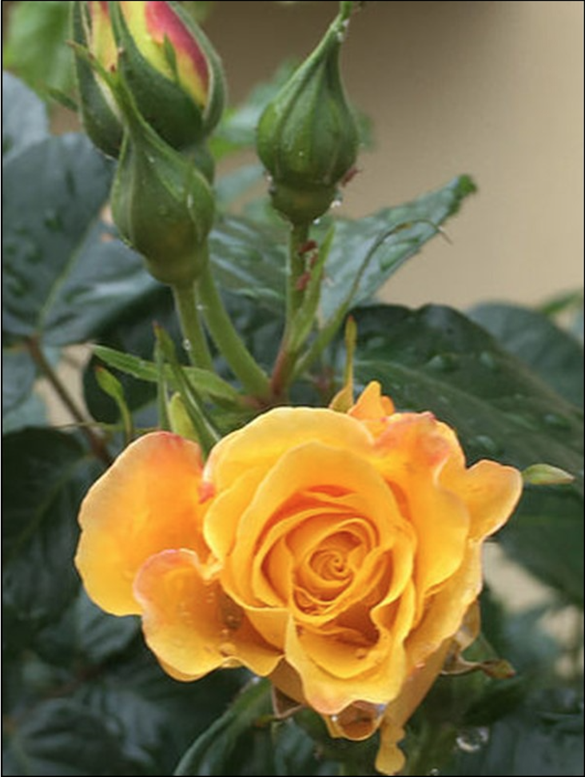 | 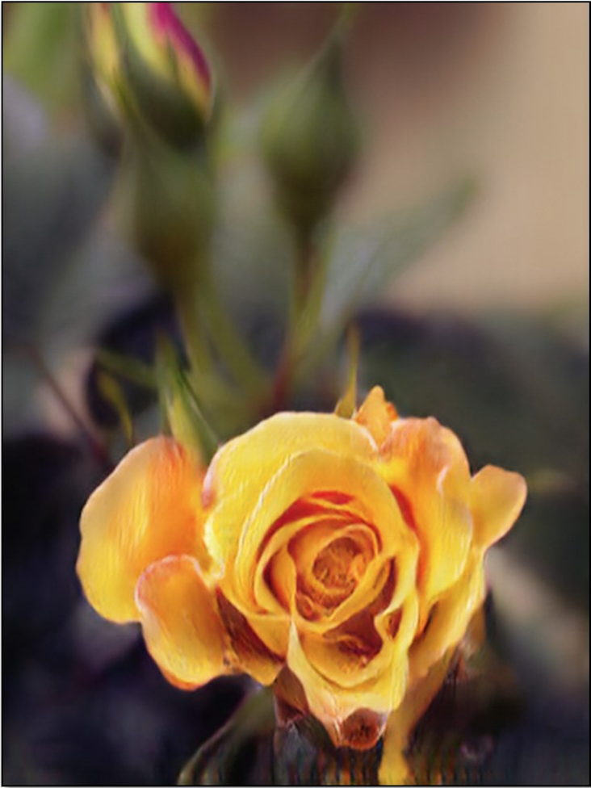 |

## About CycleGAN
In CycleGAN, they introduce two cycle consistency losses that capture the intuition that if
we translate from one domain to the other and back again we should arrive at where we started.

More specifically, the two losses are `forward cycle-consistency loss` and `backward cycle-consistency loss`.
1. forward cycle-consistency loss: x → G(x) → F(G(x)) ≈ x
2. backward cycle-consistency loss: y → F(y) → G(F(y)) ≈ y

In the original paper, the `total cycle loss` is defined as:
```python
loss = self.lambda1*forward_loss + self.lambda2*backward_loss
```
which is the sum of two L1 normalized loss(forward_loss amd backward_loss).

Apart from the `cycle loss`, the `identity loss` is also introduced in the paper. The intuition behind the `identity loss` is to encourage the mapping to preserve color composition between the input and output. 

##  Qualitative Results
We use our personal image (e.g., photoed by our iPhones) as inputs.

| DSLR ← iPhone | iPhone ← DSLR |
|---------------|---------------|
|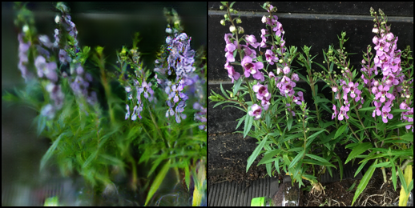||
|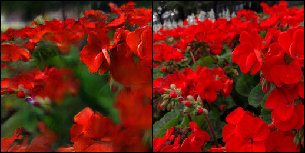|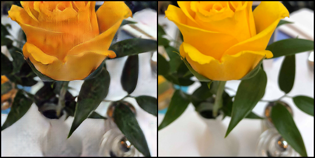|
|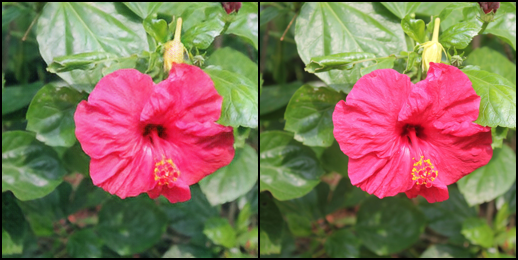|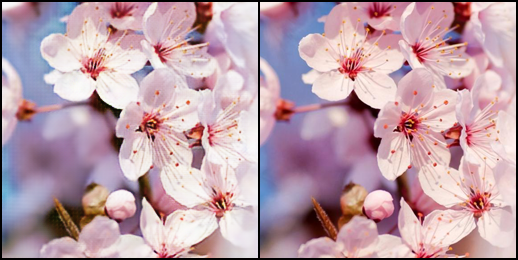|
|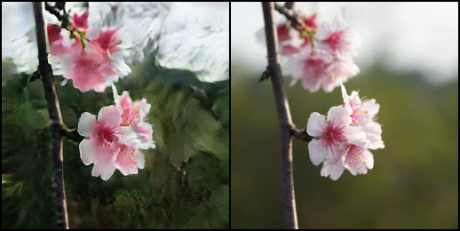|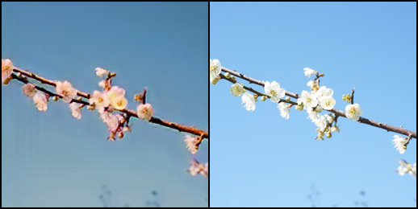|
|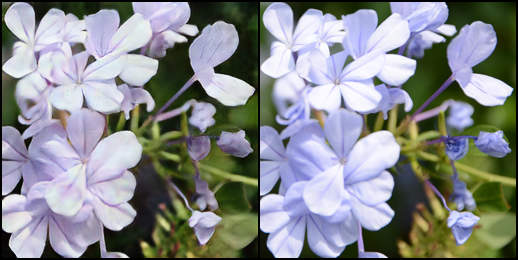|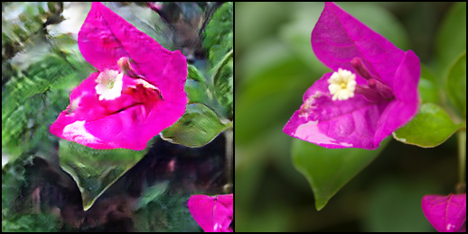|
